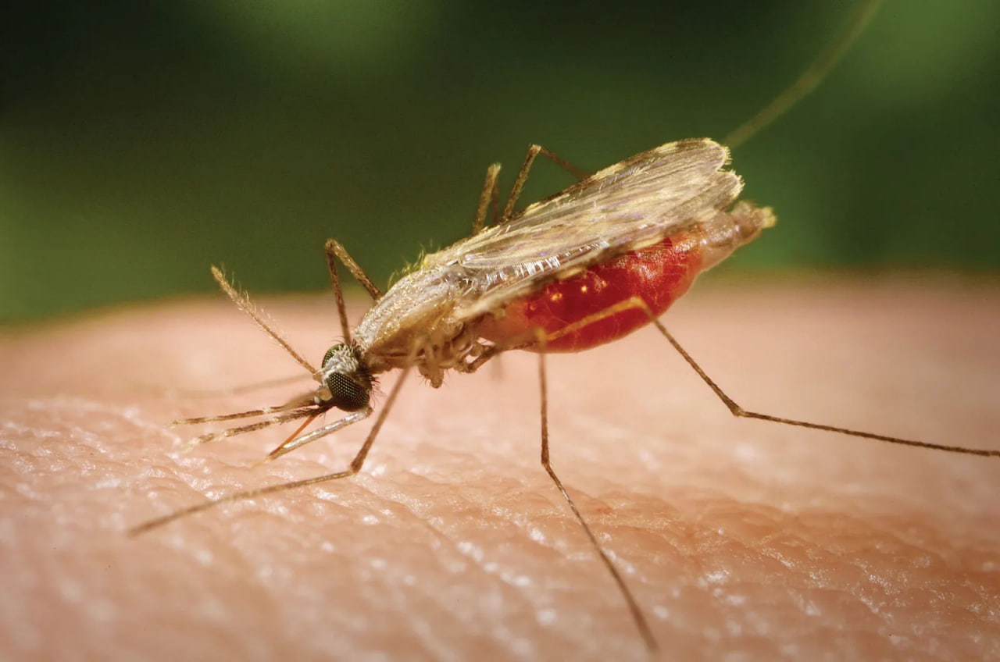
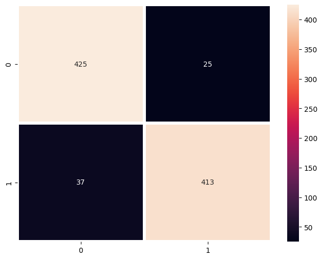

# 🦠 Malaria Cell Classification Using Convolutional Neural Networks (CNN)



## 📄 **Project Overview**

This project focuses on building a **Convolutional Neural Network (CNN)** to classify **parasitized** and **uninfected** malaria cell images. The goal is to assist in **early and accurate diagnosis** of malaria using deep learning techniques. The model is built from scratch using **TensorFlow** and **Keras**, with careful image preprocessing to reduce training time and handle GPU limitations.

---

## 🚀 **Project Highlights**

* **Deep Learning Approach:** Custom CNN architecture for binary image classification.
* **Image Preprocessing:** Rescaling and normalization of images prior to training for faster computation.
* **Performance Optimization:** Optimized architecture over transfer learning to address hardware limitations.
* **Evaluation Metrics:** Achieved 94% accuracy with robust evaluation techniques.
* **Healthcare Impact:** Demonstrates the application of AI in public health diagnostics.

---

## 📂 **Dataset**

The dataset contains microscopic images of malaria-infected and healthy blood cells, structured as:

```
cell_images/
├── Parasitized/
│   ├── C33P1thinF_IMG_20150619_114756a_cell_179.png
│   └── ...
└── Uninfected/
    ├── C1_thinF_IMG_20150604_104722_cell_9.png
    └── ...
```

**Note:** The dataset can be accessed from the [Kaggle](https://www.kaggle.com/datasets/iarunava/cell-images-for-detecting-malaria).

---

## 🛠️ **Technologies & Libraries**

* **Language:** Python 3
* **Libraries:** TensorFlow, Keras, NumPy, Matplotlib, scikit-learn
* **Tools:** Google Colab (for GPU support), Jupyter Notebook

---

## 🏗️ **Project Structure**

```
├── Malaria Cell Classifier.ipynb   # Main Jupyter Notebook
├── models/
│   └── malaria_cell_classifier.keras       # Saved CNN Model
├── data/
│   ├── Parasitized/
│   └── Uninfected/
├── README.md                      # Project Documentation
└── requirements.txt                # Dependencies
```

---

## 🔄 **Preprocessing Steps**

1. **Image Rescaling:** All images are resized to 64x64 pixels.
2. **Normalization:** Pixel values are scaled to the \[0, 1] range.
3. **Dataset Splitting:**

   * 70% Training
   * 20% Validation
   * 10% Testing

---

## 🧱 **Model Architecture**

* **Convolutional Layers:** 3 Conv2D layers with ReLU activation
* **Pooling Layers:** MaxPooling2D layers after each convolutional block
* **Dropout:** To prevent overfitting
* **Dense Layers:** Fully connected layers with softmax activation for binary classification

**Model Summary:**

```
Conv2D -> MaxPooling2D -> Conv2D -> MaxPooling2D -> Conv2D -> Flatten -> Dense -> Output
```

---

## 🏃 **Training the Model**

```python
model.fit(
    X_train, y_train,
    epochs=10,
    validation_data=(X_val, y_val),
    batch_size=32
)
```

---

## 📈 **Model Evaluation**

```python
loss, accuracy = model.evaluate(X_test, y_test)
print(f"Test Accuracy: {accuracy * 100:.2f}%")
```

---

## 💾 **Saving and Loading the Model**

**Saving:**

```python
model.save('model/malaria_cell_classifier.keras')  # Saved in HDF5 format

```

**Loading:**

```python
from tensorflow.keras.models import load_model
loaded_model = load_model('model/malaria_cell_classifier.keras')
```

---

## 🔍 **Making Predictions**

```python
import numpy as np
sample_image = np.expand_dims(X_test[0], axis=0)
prediction = loaded_model.predict(sample_image)
print("Predicted Class:", 'Parasitized' if np.argmax(prediction) == 1 else 'Uninfected')
```

---

## ⚡ **Results & Performance**

* **Test Accuracy:** 94%
* **Observations:**

  * Model performs well in distinguishing parasitized cells from uninfected ones.
  * Preprocessing before training significantly reduced training time.

---

## 🏥 **Potential Applications**

* Automated malaria screening in healthcare centers.
* Integrating the model into diagnostic tools for faster detection.
* Aiding medical professionals in resource-limited settings.

---

## 🎯 **Future Work**

* Deploying the model using **Flask** or **FastAPI** for real-time predictions.
* Improving performance using **data augmentation** and **hyperparameter tuning**.
* Exploring **mobile deployment** using **TensorFlow Lite**.

---

## 🤝 **Contributing**

Pull requests are welcome! For major changes, please open an issue first to discuss what you would like to change.

---

## 📝 **License**

This project is licensed under the [MIT License](LICENSE).

---

## 💬 **Contact**

**Ojo Timilehin**
📧 [ojotimilehin01@gmail.com](mailto:ojotimilehin01@gmail.com)
📞 +2348143684739

---

## ⭐ **Acknowledgments**

* [Kaggle](https://www.kaggle.com/datasets/iarunava/cell-images-for-detecting-malaria)
* TensorFlow & Keras Documentation
* Google Colab for providing free GPU resources

---

> *This project demonstrates the intersection of deep learning and healthcare, showcasing how AI can drive better diagnostic solutions for global health challenges like malaria.* 🌍💡

Thank you
